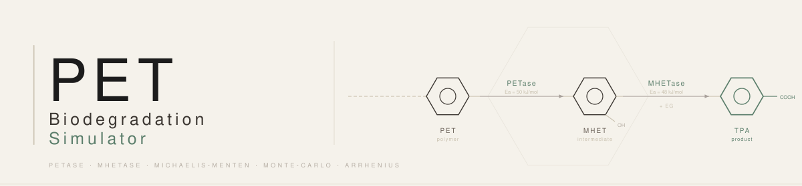

# PET Biodegradation Simulator

A fully local scientific simulator for the enzymatic degradation of PET plastic via PETase and MHETase enzymes. Models the coupled reaction pathway using Michaelis-Menten kinetics with Arrhenius temperature correction and Monte-Carlo uncertainty analysis.

**No cloud APIs. No costs. Runs entirely on your machine.**

---

## Table of Contents

- [Scientific Background](#scientific-background)
- [Mathematical Model](#mathematical-model)
- [Project Structure](#project-structure)
- [Installation](#installation)
- [Usage](#usage)
  - [CLI](#cli)
  - [Web Dashboard](#web-dashboard)
  - [Tests](#tests)
- [Architecture](#architecture)
  - [Core Engine](#core-engine)
  - [Simulation Layer](#simulation-layer)
  - [Data Layer](#data-layer)
  - [Frontend](#frontend)
- [Literature Values](#literature-values)
- [Example Output](#example-output)

---

## Scientific Background

PET (polyethylene terephthalate) is one of the most widely produced plastics. In 2016, Yoshida et al. discovered *Ideonella sakaiensis*, a bacterium capable of degrading PET via two enzymes:

1. **PETase** — cleaves the PET polymer into MHET (mono(2-hydroxyethyl) terephthalate)
2. **MHETase** — further hydrolyzes MHET into TPA (terephthalic acid) and EG (ethylene glycol)

```
PET  ──[PETase]──►  MHET  ──[MHETase]──►  TPA + EG
```

Both TPA and EG are non-toxic and can be used as carbon sources by microorganisms, making this pathway a candidate for biological plastic recycling.

This simulator implements the kinetic model of this two-step degradation using parameters measured by Yoshida et al. (2016) and Tournier et al. (2020), who engineered a thermostable PETase variant (FAST-PETase) with significantly improved activity.

---

## Mathematical Model

### Michaelis-Menten Kinetics

Each enzymatic reaction follows the Michaelis-Menten equation:

$$v = \frac{V_{max} \cdot [S]}{K_m + [S]}$$

- $V_{max}$ — maximum reaction rate (µmol/min/mg enzyme)
- $K_m$ — substrate concentration at half-maximal rate (mM)
- $[S]$ — substrate concentration (mM)

### Arrhenius Temperature Correction

Temperature dependence is modeled using a normalized Arrhenius factor:

$$f(T) = \exp\!\left(\frac{E_a}{R} \cdot \left(\frac{1}{T_{ref}} - \frac{1}{T}\right)\right)$$

- $E_a$ — activation energy (J/mol)
- $R = 8.314$ J/mol·K — universal gas constant
- $T$ — simulation temperature (Kelvin)
- $T_{ref} = 303.15\,K$ (30°C) — reference temperature at which literature $V_{max}$ values were measured

This normalized form ensures $f(T_{ref}) = 1.0$, preserving the literature $V_{max}$ values at their measurement conditions. The factor increases with temperature (faster reaction) and decreases below the reference (slower reaction).

### pH Correction

A Gaussian pH correction is applied to both enzymes:

$$f_{pH} = \exp\!\left(-\frac{1}{2}\left(\frac{pH - pH_{opt}}{\sigma_{pH}}\right)^2\right)$$

with optimum $pH_{opt} = 7.0$ and width $\sigma_{pH} = 1.0$.

### ODE System

The full effective rate for each enzyme:

$$v_1 = \frac{V_{max,P} \cdot [PET]}{K_{m,P} + [PET]} \cdot f_{Arr}(T, E_{a,P}) \cdot f_{pH}$$

$$v_2 = \frac{V_{max,M} \cdot [MHET]}{K_{m,M} + [MHET]} \cdot f_{Arr}(T, E_{a,M}) \cdot f_{pH}$$

The coupled ODE system with three state variables:

$$\frac{d[PET]}{dt} = -v_1$$

$$\frac{d[MHET]}{dt} = v_1 - v_2$$

$$\frac{d[TPA]}{dt} = v_2$$

**Mass conservation:** $[PET] + [MHET] + [TPA] = const$ (verified within ±1% tolerance).

### Monte-Carlo Uncertainty Analysis

To account for experimental variability in the literature parameters, Monte-Carlo sampling draws $N$ independent runs from:

$$V_{max}^{(i)} \sim \mathcal{N}(\mu_{V_{max}},\; (0.15 \cdot \mu_{V_{max}})^2)$$
$$K_m^{(i)} \sim \mathcal{N}(\mu_{K_m},\; (0.15 \cdot \mu_{K_m})^2)$$

This ±15% noise reflects typical inter-laboratory variability. The 95% confidence interval is computed via `scipy.stats.norm.interval`.

---

## Project Structure

```
bio-degradation-sim/
├── CLAUDE.md                   # Project context and architecture rules
├── README.md                   # This file
├── requirements.txt            # Python dependencies
├── main.py                     # CLI entry point
│
├── core/                       # Pure scientific functions (no I/O, no side effects)
│   ├── __init__.py
│   ├── kinetik.py              # michaelis_menten(v_max, km, substrate) → float
│   ├── arrhenius.py            # arrhenius_factor(ea, temp_celsius) → float
│   │                           # ph_factor(ph) → float
│   └── ode_solver.py           # solve_degradation(params, t_span) → dict
│
├── simulation/                 # Statistical analysis layer
│   ├── __init__.py
│   ├── monte_carlo.py          # run_monte_carlo(base_params, n_runs) → DataFrame
│   ├── parameter_space.py      # generate_parameter_grid(temp_range, ph_range) → list
│   └── results.py              # aggregate_results(mc_df) → dict
│
├── data/                       # Persistence layer
│   ├── schema.sql              # 4-table SQLite schema
│   ├── db.py                   # SQLiteManager class
│   └── seeds.py                # Inserts literature values on first run
│
├── frontend/                   # Web dashboard
│   ├── index.html              # Dashboard UI (Chart.js, 3 sliders)
│   ├── sim.js                  # API calls, chart updates, debounce logic
│   └── server.py               # Local HTTP server on port 8765
│
└── tests/
    ├── test_kinetik.py         # Unit tests: Michaelis-Menten properties
    ├── test_arrhenius.py       # Unit tests: Arrhenius factor, pH factor
    └── test_ode.py             # Integration tests: mass conservation, monotonicity
```

---

## Installation

**Requirements:** Python 3.10+

```bash
git clone https://github.com/wnk8/bio-degradation-sim.git
cd bio-degradation-sim
pip install -r requirements.txt
```

Dependencies (all free, pip-installable):

| Package | Purpose |
|---|---|
| `numpy` | Monte-Carlo sampling, array operations |
| `scipy` | ODE solver (`solve_ivp`), confidence intervals |
| `matplotlib` | Optional: static plot export |
| `pandas` | Monte-Carlo results as DataFrames |
| `sqlite3` | Database persistence (Python stdlib, no install needed) |

---

## Usage

### CLI

```bash
python main.py --temp 30 --ph 7.0 --runs 500
```

| Flag | Default | Description |
|---|---|---|
| `--temp` | `30.0` | Simulation temperature (°C) |
| `--ph` | `7.0` | pH value |
| `--pet0` | `1.0` | Initial PET concentration (mM) |
| `--runs` | `500` | Number of Monte-Carlo runs |
| `--no-db` | off | Skip saving result to database |
| `--no-grid` | off | Skip Temp×pH grid search (faster) |

The CLI will:
1. Initialize the SQLite database and insert literature values (first run only)
2. Run Monte-Carlo simulation with the specified parameters
3. Search the Temp×pH parameter grid for optimal conditions
4. Save results to `data/simulation.db`
5. Print a formatted summary table

### Web Dashboard

```bash
python frontend/server.py
```

Open **http://localhost:8765** in your browser.

The dashboard provides:

- **ODE Time Course chart** — [PET], [MHET], [TPA] concentration vs. time (0–120 min)
- **Heatmap chart** — Temperature × pH → mean degradation rate as a bubble chart
- **3 interactive sliders:**
  - Temperature: 0–80°C
  - pH: 4–10
  - Initial PET concentration [PET]₀: 0.1–5 mM
- Charts update automatically 300ms after any slider change

**API endpoints** (served on port 8765):

| Endpoint | Parameters | Response |
|---|---|---|
| `GET /api/simulate` | `temp`, `ph`, `runs`, `pet0` | ODE arrays + MC aggregates |
| `GET /api/heatmap` | `runs` | 2D rate matrix over Temp×pH |

### Tests

```bash
python -m pytest tests/ -v
```

19 tests across 3 modules — expected output: **19 passed**.

| Test file | What is verified |
|---|---|
| `test_kinetik.py` | $v = V_{max}/2$ at $[S]=K_m$; zero substrate; high-substrate limit; literature values |
| `test_arrhenius.py` | $f(T_{ref})=1.0$; monotone increase with T; pH optimum at 7.0; edge cases |
| `test_ode.py` | PET decreases; TPA increases; mass conservation ±1%; non-negative concentrations |

---

## Architecture

### Core Engine

The `core/` module contains pure mathematical functions with no side effects:

**`kinetik.py`** — Implements the Michaelis-Menten equation. Input validation raises `ValueError` for negative substrates or non-positive $K_m$.

**`arrhenius.py`** — Implements the normalized Arrhenius factor and the Gaussian pH correction factor. Temperature is always passed in °C and converted to Kelvin internally.

**`ode_solver.py`** — Wraps `scipy.integrate.solve_ivp` (RK45 method, `rtol=1e-6`, `atol=1e-9`). Pre-computes effective $V_{max}$ values (incorporating Arrhenius and pH factors) before integration to avoid redundant exponential calculations inside the inner loop. Negative concentrations are clamped to 0 to prevent numerical artifacts.

### Simulation Layer

**`monte_carlo.py`** — Samples $V_{max}$ and $K_m$ for both enzymes independently from $\mathcal{N}(\mu, 0.15\mu)$ using `numpy.random.default_rng`. Samples below 1% of the mean are clamped. Each run calls `solve_degradation` and records final TPA, max rate (via finite differences on TPA), and half-life $t_{1/2}$.

**`parameter_space.py`** — Generates a Cartesian product of temperature and pH values using `numpy.meshgrid`. Used by both the CLI grid search and the heatmap endpoint.

**`results.py`** — Aggregates a Monte-Carlo DataFrame into a statistics dict. 95% confidence interval is computed via `scipy.stats.norm.interval` on the mean ± SEM of final TPA values.

### Data Layer

**`schema.sql`** — Four tables:
- `runs` — metadata (timestamp, temp, pH, n_runs)
- `parameters` — per-run kinetic parameters
- `results` — per-run aggregated statistics
- `literature_values` — reference values from Yoshida/Tournier (inserted once)

**`db.py`** — `SQLiteManager` class using raw `sqlite3` (no ORM). Foreign keys are enforced via `PRAGMA foreign_keys = ON`. Schema is applied idempotently on init via `CREATE TABLE IF NOT EXISTS`.

**`seeds.py`** — Checks `SELECT COUNT(*) FROM literature_values` before inserting to ensure idempotency.

### Frontend

**`server.py`** — A minimal `http.server.HTTPServer` with a custom `BaseHTTPRequestHandler`. No framework dependencies. The `/api/simulate` endpoint runs a full Monte-Carlo + ODE simulation on each request; `/api/heatmap` runs a lighter 50-run MC across a 9×5 Temp×pH grid.

**`sim.js`** — Chart.js 4.4 line chart for ODE time course; bubble chart for the heatmap (bubble radius encodes relative rate, color interpolates from red→green). A 300ms debounce prevents excessive API calls during slider dragging.

---

## Literature Values

| Enzyme | Parameter | Value | Unit | Source |
|---|---|---|---|---|
| PETase | $V_{max}$ | 0.026 | µmol/min/mg | Yoshida et al. 2016 |
| PETase | $K_m$ | 0.15 | mM | Yoshida et al. 2016 |
| PETase | $E_a$ | 50,000 | J/mol | Yoshida et al. 2016 |
| MHETase | $V_{max}$ | 0.083 | µmol/min/mg | Tournier et al. 2020 |
| MHETase | $K_m$ | 0.21 | mM | Tournier et al. 2020 |
| MHETase | $E_a$ | 48,000 | J/mol | Tournier et al. 2020 |

**References:**
- Yoshida, S. et al. (2016). A bacterium that degrades and assimilates poly(ethylene terephthalate). *Science*, 351(6278), 1196–1199.
- Tournier, V. et al. (2020). An engineered PET depolymerase to break down and recycle plastic bottles. *Nature*, 580(7802), 216–219.

---

## Example Output

```
╔════════════════════════════════════════════════════════╗
║         PET-Abbau Simulation — Zusammenfassung         ║
╠════════════════════════════════════════════════════════╣
║  Simulation                T=30.0°C  pH=7.0  [PET]₀=1.0 mM
║  Monte-Carlo Runs          500 (500 gültig)
╠════════════════════════════════════════════════════════╣
║  Finale TPA (Mittel)       9.9994e-01 mM
║  95%-KI finale TPA         [9.9991e-01, 9.9998e-01] mM
║  Max. Degradationsrate     3.0228e-02 µmol/min/mg
║  Mittl. Rate (MC)          2.1183e-02 µmol/min/mg
║  Mittl. Halbwertszeit      2.3852e+01 min
╠════════════════════════════════════════════════════════╣
║  Optimale Temperatur       70.0 °C
║  Optimaler pH              7.0
║  Max. Rate (Grid)          2.0039e-01 µmol/min/mg
╚════════════════════════════════════════════════════════╝
```

At 30°C and pH 7.0, ~99.99% of the initial PET is converted to TPA within 120 minutes, with a half-life of ~24 minutes. The parameter grid identifies 70°C as the kinetically optimal temperature (Arrhenius-driven), consistent with thermostable PETase engineering efforts reported in the literature.
